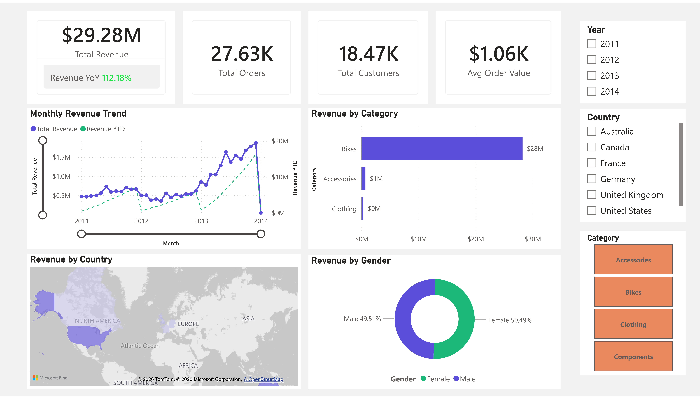
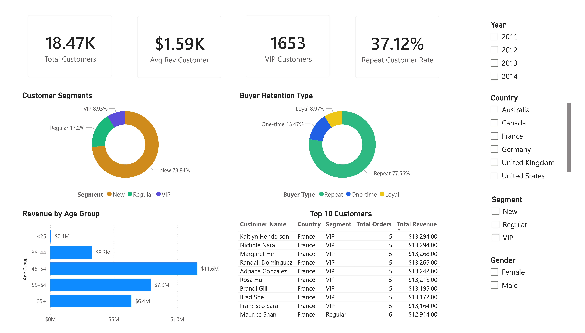
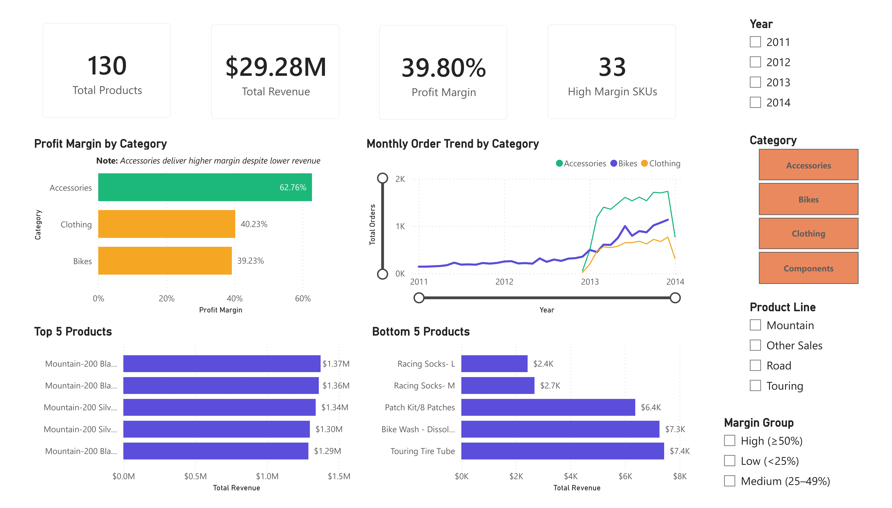

# 📊 SQL Data Analytics & BI Dashboard
 
Analytical layer built on top of a [previously developed SQL Data Warehouse](https://github.com/faridd35/end-to-end-data-engineering-sql), covering exploratory analysis, customer segmentation, product performance, and an interactive Power BI dashboard.

---

## 🗂️ Project Structure
 
```
sql-data-analytics-dashboard-project/
├── scripts/
│   ├── 01-exploratory-analysis.sql
│   ├── 02-sales-trends.sql
│   ├── 03-customer-segmentation.sql
│   └── 04-product-performance.sql
├── reports/
│   ├── sales_dashboard.pbix
│   └── screenshots/
│       ├── overview.jpg
│       ├── customers.jpg
│       └── products.jpg
├── LICENSE
└── README.md
```

---
## 🗄️ Data Source
 
This project consumes the **Gold layer** (star schema) from the SQL Data Warehouse project:
 
| Table | Description |
|-------|-------------|
| `gold.fact_sales` | Sales transactions — order line grain |
| `gold.dim_customers` | Customer profiles (CRM + ERP integrated) |
| `gold.dim_products` | Product catalog (CRM + ERP integrated) |
 
→ **Source repo:** [end-to-end-data-engineering-sql](https://github.com/faridd35/end-to-end-data-engineering-sql)
 
---

## 🔍 SQL Analytics
 
Four analysis scripts covering the full analytical scope:
 
| Script | Focus | Key Techniques |
|--------|-------|---------------|
| `01-exploratory-analysis.sql` | Data profiling & KPI overview | Aggregations, null checks, ranking |
| `02-sales-trends.sql` | Revenue trend & growth rates | `LAG()`, running total, `DATEADD` |
| `03-customer-segmentation.sql` | Customer behavior & segmentation | `CASE`, `ROW_NUMBER()`, retention analysis |
| `04-product-performance.sql` | Product ranking & profit analysis | `RANK()`, benchmark comparison, margin |
 
---
## 📈 Power BI Dashboard
 
Three-page interactive dashboard built on top of the SQL analytics layer.
 
**Page 1 — Overview**
Sales summary with monthly revenue trend, revenue by category, geographic distribution, and gender breakdown.
 

 
**Page 2 — Customers**
Customer segmentation (VIP / Regular / New), age group analysis, buyer retention type, and top 10 customers by revenue.
 

 
**Page 3 — Products**
Profit margin by category, top 5 vs bottom 5 products, and monthly order trend by category.
 


### Key Insights
 
- **Bikes** dominates revenue at ~$28M (96% of total), but **Accessories carry the highest profit margin at 62%** — significantly above Bikes at 39%
- **77% of customers are repeat buyers**, indicating strong retention despite 73% being classified as "New" by spend/lifespan criteria
- **Age group 45–54 is the highest-revenue segment** at $11.6M
- Revenue shows a **consistent upward trend from 2011–2014**, with visible seasonal spikes in mid-year months
---
 
## 🛠️ Tech Stack
 
| Tool | Role |
|------|------|
| **SQL Server + SSMS** | Data source (Gold layer views) |
| **T-SQL** | Exploratory & analytical queries |
| **Power BI Desktop** | Dashboard & visualization |
| **DAX** | Measures, calculated columns, time intelligence |
 
---
